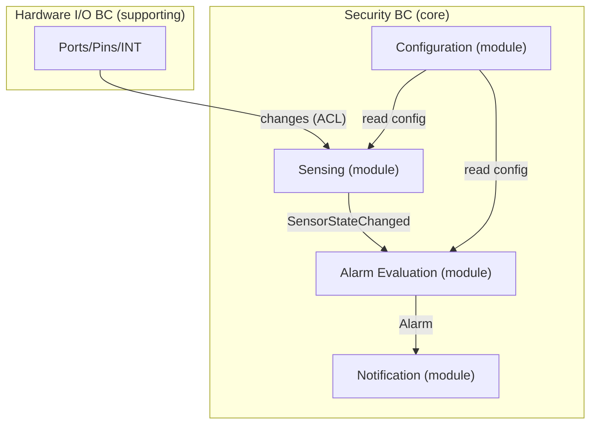

# Context Map

## Roles and Responsibilities
| Role               | Responsibilities                                                                                   |
|:-------------------|:----------------------------------------------------------------------------------------------------|
| Software Architect | Lead: Define bounded contexts, responsibilities, and relationships (e.g., events, APIs).           |
| Product Manager    | Input: Validate domain responsibilities and terms align with business needs.                        |
| Stakeholders       | Input: Confirm domain boundaries reflect business processes.                                        |

## Bounded Contexts
1. **Hardware I/O BC (supporting)**
   - **Purpose**: Interface with MCP23017 over I2C and the Raspberry Pi GPIO INT line.
   - **Responsibilities**: Configure device, manage interrupts/debounce, expose raw port reads and change notifications behind a stable contract.
   - **Relationships**: Publishes hardware change notifications to the Security BC via an ACL.
2. **Security BC (core)**
   - **Purpose**: Model security behavior and rules using the domain language (`Sensor`, `SensorGroup`, `SensorReading`, `SecurityConfig`, `Alarm`).
   - **Subdomains (modules within this BC)**:
     - Sensing: Transform raw port-level changes into typed `SensorReading`; detect transitions; emit `SensorStateChanged`.
     - Alarm Evaluation: Apply arming/mode/time-window rules (via OPA) to emit `Alarm` events.
     - Configuration: Manage groups, arming, schedules; provide read access to Sensing/Alarm.
     - Notification: Deliver `Alarm` events to outputs (e.g., logs, sounder).
   - **Relationships**: Subscribes to Hardware I/O (via ACL); exposes read streams and events to UI/Notification.

## Context Relationships (Map)

## Integration
- **Shared IDs**: `sensor_id`, `group_id`.
- **Events**:
  - `SensorStateChanged` (from Security BC — Sensing module)
  - `Alarm` (from Security BC — Alarm Evaluation module)
- **APIs**:
  - Configuration (module) provides read APIs for groups, schedules, arming state.
  - Hardware I/O BC provides device-facing read-port and subscribe interfaces via ACL.
  - Alarm Evaluation (module) exposes a read stream of `Alarm` events to Notification (module).
- **Contracts**: see `docs/07-interface-contracts.md` for event/DTO schemas and versioning.
- **Runtime sequencing**: see `docs/08-runtime-flows.md#interrupt-and-event-flow` for how contexts interact at runtime.
