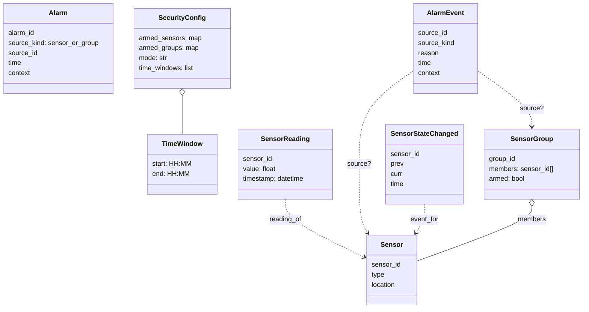

# Domain Model

 

## Ubiquitous Language
- Sensor: A physical input (e.g., front door reed, PIR motion) identified by `sensor_id`.
- SensorGroup: A named collection of sensors (e.g., `windows`, `downstairs`).
- SensorReading: Observed value with timestamp for a `sensor_id`.
- SecurityConfig: Configuration governing arming state and rules (mode and time windows).
- Event: A domain-relevant occurrence (e.g., door opening, motion detected).
- ErrorEvent: An error condition surfaced as an event.
- PIR: A passive infrared sensor that detects motion.
- Reed: A reed switch that detects the opening or closing of a door or window.
- Mode: Operating mode (e.g., `home_day`, `home_night`, `away`) influencing evaluation.

## Domain Diagram
See architecture wiring in `docs/06-architecture-overview.md#architecture-diagram`.

## Aggregates and Entities
- Sensor (Entity)
  - Identity: `sensor_id`
  - Attributes: `type` (reed, PIR, ...), `location`
- SensorGroup (Entity/Aggregate Root)
  - Identity: `group_id`
  - Members: `sensor_id[]`
  - State: `armed: bool`
- Alarm (Entity)
  - Identity: `alarm_id`
  - Attributes: `source` (sensor/group), `time`, `context`

## Value Objects
- SensorReading(sensor_id: str, value: float, timestamp: datetime)
- SecurityConfig(armed: { sensors: map[sensor_id -> bool], groups: map[group_id -> bool] }, mode: str, time_windows: TimeWindow[])
- TimeWindow(start: HH:MM, end: HH:MM)

## Domain Services
- SensorDeserializerService
  - Responsibility: Map raw hardware bytes into `SensorReading` objects.
  - Notes: Hardware-specific adapters live outside the domain; service operates on abstractions.
- SemanticMapperService
  - Responsibility: Evaluate readings + `SecurityConfig` to produce domain `Event`s (e.g., Alarm).
- SecurityContextService
  - Responsibility: Provide current time/mode context for evaluating rules.

## Repository
- SensorReadingRepository
  - Responsibility: Track previous readings per `sensor_id` to detect state changes.

## Domain Events
- Note: Wire schemas and versioning are defined in `docs/07-interface-contracts.md`; this section is conceptual.
- SensorStateChanged(sensor_id, prev, curr, time)
- Alarm(source_id, source_kind: sensor|group, reason, time, context)
- ErrorEvent(code, details, time)

## Invariants and Policies (high level)
- A group can only be armed if all member sensors are in a safe state.
- Alarms are only generated when:
  - The source (sensor or group) is armed, and
  - A meaningful state change occurs, and
  - The change happens within restricted times, if configured.
- Sensor reading transitions and thresholds are defined per sensor type.

## Notes on Boundaries
- Domain model is technology-agnostic; no I2C, GPIO, or MCP23017 details here.
- Hardware integration, debounce, and interrupt behavior are specified in `07-interface-contracts.md` and implementation docs.
- Architecture maps functions (Crawley) to forms; see `06-architecture-overview.md`.
- Bounded contexts: Hardware I/O BC (supporting) and Security BC (core). Sensing, Alarm Evaluation, Configuration, and Notification are subdomains (modules) inside the Security BC; see `04-context-map.md`.
