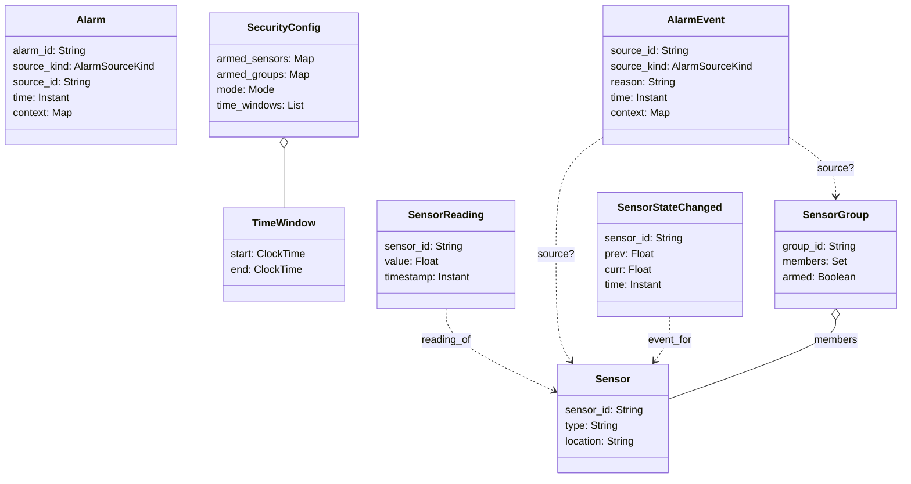

# Domain Model

 
## Ubiquitous Language
- Sensor: A physical input (e.g., front door reed, PIR motion) identified by a sensor identifier (user-assigned name).
- Sensor Identifier: The unique, human-friendly name for a sensor.
- Sensor Group: A named collection of sensors (e.g., `windows`, `downstairs`).
- Sensor Reading: Observed reading with timestamp for a sensor.
- Security Configuration: Configuration governing arming state and rules (mode and time windows).
- Event: A domain-relevant occurrence (e.g., door opening, motion detected).
- Error Event: An error condition surfaced as an event.
- PIR: A passive infrared sensor that detects motion.
- Reed: A reed switch that detects the opening or closing of a door or window.
- Mode: Operating mode (e.g., `home_day`, `home_night`, `away`) influencing evaluation.

## Enumerations

- AlarmSourceKind = {"sensor", "group"}
- Mode = {"home_day", "home_night", "away"}

### Terminology Mapping

The table maps plain terms (UL) to modeled names and wire-level identifiers. See `docs/07-interface-contracts.md` for payload details.

| UL term           | Domain model name | Field/Type                                                                                 | Wire-level name/format                         |
| :---------------- | :---------------- | :------------------------------------------------------------------------------------------- | :--------------------------------------------- |
| sensor identifier | sensor_id         | String                                                                                        | "sensor_id" (string)                           |
| sensor group      | SensorGroup       | { group_id: String, members: Set<String>, armed: Boolean }                                   | "group_id" (string)                            |
| sensor reading    | SensorReading     | { sensor_id: String, value: Float, timestamp: Instant }                                       | Events carry "sensor_id"; time is ISO-8601 UTC |
| time instant      | timestamp         | Instant                                                                                        | ISO-8601 UTC string in payloads                |
| security config   | SecurityConfig    | { armed: { sensors: Map<String, Boolean>, groups: Map<String, Boolean> }, mode: Mode, time_windows: List<TimeWindow> } | See Configuration Read Interfaces               |

## Domain Diagram
See architecture wiring in `docs/06-architecture-overview.md#architecture-diagram`.

## Aggregates and Entities
- Sensor (Entity)
  - Identity: `sensor_id`
  - Attributes: `type` (reed, PIR, ...), `location`
- SensorGroup (Entity/Aggregate Root)
  - Identity: `group_id`
  - Members: `Set<sensor_id>`
  - State: `armed: Boolean`
- Alarm (Entity)
  - Identity: `alarm_id`
  - Attributes: `source` (sensor/group), `time`, `context`

## Value Objects
- SensorReading(sensor_id: String, value: Float, timestamp: Instant)
- SecurityConfig(armed: { sensors: Map<String, Boolean>, groups: Map<String, Boolean> }, mode: Mode, time_windows: List<TimeWindow>)
- TimeWindow(start: ClockTime, end: ClockTime)

### Timestamp Semantics

- Domain: `Instant` represents a point in time; neutral to storage/transport.
- Code: represented as UNIX epoch seconds (`float`) in `models/SensorReading`.
- Wire: represented as ISO-8601 UTC strings in events and ACL payloads (see `docs/07-interface-contracts.md`).

## Domain Services
- SensorDeserializerService
  - Responsibility: Map raw hardware bytes into `SensorReading` objects.
  - Notes: Hardware-specific adapters live outside the domain; service operates on abstractions.
- SemanticMapperService
  - Responsibility: Evaluate readings + `SecurityConfig` to produce domain `Event`s (e.g., Alarm).
- SecurityContextService
  - Responsibility: Provide current time/mode context for evaluating rules.

## Repository
- SensorReadingRepository
  - Responsibility: Track previous readings per sensor identifier to detect state changes.

## Domain Events
- Note: Wire schemas and versioning are defined in `docs/07-interface-contracts.md`; this section is conceptual.
- SensorStateChanged(sensor_id: String, prev: Float, curr: Float, time: Instant)
- Alarm(source_id: String, source_kind: AlarmSourceKind, reason: String, time: Instant, context: Map<String, String>)
- ErrorEvent(code: String, details: String, time: Instant)

## Invariants and Policies (high level)
- A group can only be armed if all member sensors are in a safe state.
- Alarms are only generated when:
  - The source (sensor or group) is armed, and
  - A meaningful state change occurs, and
  - The change happens within restricted times, if configured.
- Sensor reading transitions and thresholds are defined per sensor type.

## Notes on Boundaries
- Domain model is technology-agnostic; no I2C, GPIO, or MCP23017 details here.
- Hardware integration, debounce, and interrupt behavior are specified in `07-interface-contracts.md` and implementation docs.
- Architecture maps functions (Crawley) to forms; see `06-architecture-overview.md`.
- Bounded contexts: Hardware I/O BC (supporting) and Security BC (core). Sensing, Alarm Evaluation, Configuration, and Notification are subdomains (modules) inside the Security BC; see `04-context-map.md`.
