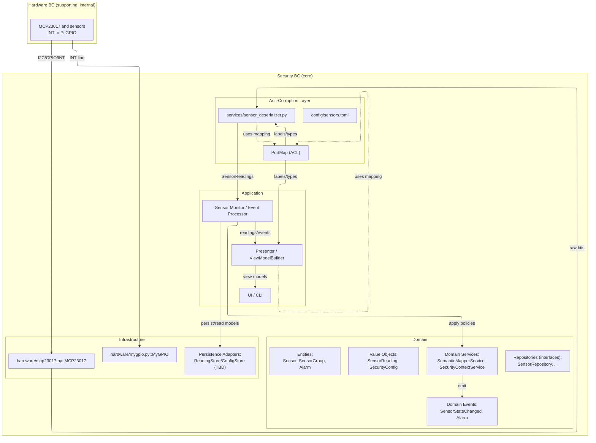

# Architecture Overview

## Overview
This document outlines the high-level technical architecture for the Home Security System, describing how concrete software/hardware forms map to system functions (Crawley) and how contexts interact (see `04-context-map.md` and `05-domain-model.md`).

## Architecture Diagram

For the domain view, see `05-domain-model.md#domain-diagram`.

## Architecture Layers

This mirrors the normative rules defined in [DEVELOPER_GUIDE.md › Doc-change protocol](../DEVELOPER_GUIDE.md#doc-change-protocol). If discrepancies occur, the Developer Guide prevails and an ADR must be raised.

- Domain: depends on nothing (no imports from Application/Infrastructure/ACL/UI).
- Application: may depend on Domain and ACL ports/types; not on Infrastructure.
- ACL: may depend on Hardware BC and Domain types; Domain must not depend on ACL.
- Infrastructure: may depend on Application/Domain to implement their interfaces; Domain/Application do not depend on Infrastructure.
- UI/Presenter: depends on Application DTOs/services; avoid reaching into Domain internals directly.

### Placement guidance (pragmatic)

- Application: orchestration and presenters (e.g., Sensor Monitor/Event Processor, ViewModel builders).
- Domain: entities, value objects, domain services, domain events, repository interfaces (aggregates only).
- ACL: translators/mappers between hardware-centric data and domain types.
- Infrastructure: concrete adapters (I2C/GPIO/persistence/logging).
- Hardware BC (supporting, internal): chip/wiring-centric code and contracts.

Note: In line with `04-context-map.md`, the Security BC comprises subdomains (modules): Sensing, Alarm Evaluation, Configuration, and Notification. These are modules inside the Security BC, not separate bounded contexts.

### Diagram legend

- Solid arrows: data/control flow. Dashed arrows: dependency.
- Subgraphs denote layers/BCs; edges connect to nodes, not subgraph labels.

### Related docs

- Context Map: `04-context-map.md`
- Interface Contracts: `07-interface-contracts.md`
- Runtime Flows: `08-runtime-flows.md`
- Testing Strategy: `09-testing-strategy.md`
- Requirements Traceability: `10-requirements-traceability.md`
- Process: [Developer Guide › Doc-change protocol](../DEVELOPER_GUIDE.md#doc-change-protocol)

### Component Index (bridging code)

This table maps key diagram components to primary code locations. Update rows when components are added/renamed/moved. Use breadcrumbs in code (`# Arch: <ID>`) for traceability.

| ID                     | Name                     | Layer/BC            | Primary path                         | Notes                    |
|:-----------------------|:-------------------------|:--------------------|:-------------------------------------|:-------------------------|
| HW.Drv.MCP23017        | MCP23017 driver          | Infrastructure (HW) | hardware/mcp23017.py::MCP23017       | I2C config, reads        |
| HW.GPIO.INT            | Pi GPIO INT adapter      | Infrastructure (HW) | hardware/mygpio.py::MyGPIO           | Debounce ~50 ms          |
| SEC.ACL.PortMap        | PortMap (ACL) config     | ACL                 | (planned) config/port_map.toml       | pins→sensor_id,type      |
| SEC.ACL.Deser          | Sensor deserializer      | ACL                 | services/sensor_deserializer.py      | MCP bits→SensorReading   |
| SEC.APP.SensorMonitor  | Sensor Monitor           | Application         | (planned; path TBD)                  | Orchestration/event loop |
| SEC.APP.EventProc      | Event Processor          | Application         | (planned; path TBD)                  | PEP → OPA decision req   |

## Assumptions
- Runs on Raspberry Pi (Linux) with I2C enabled; MCP23017 connected per wiring guide.
- Pi GPIO INT line is available and debounced in software (~50 ms) via `gpiozero.Button`.
- Local-first system: no cloud dependency in initial phase.
- Event-driven in-process messaging between components is sufficient.

## System Functions (Crawley)
- Sensing: Acquire and decode sensor states from MCP23017.
- Alarm Evaluation: Apply arming/time-window rules to generate alarms.
- Configuration: Manage groups, arming states, and schedules.
- Notification (optional): Deliver alarms to outputs (e.g., logs, sounder).

## Mapping Form to Function (Crawley)
| Form (Implementation)                                                                                                 | Function               | Source                                      |
|:----------------------------------------------------------------------------------------------------------------------|:-----------------------|:--------------------------------------------|
| `hardware/mcp23017.py` (I2C config, read), `hardware/mygpio.py` (Pi INT line), Sensor Monitor (planned)               | Sensing                | PRD FR7–FR8; Context Map: Hardware I/O → Sensing |
| Event Processor (planned; PEP: state tracking + decision request), OPA (Rego) PDP                                      | Alarm Evaluation       | PRD FR3–FR6; Domain Model                   |
| Config storage (TBD file or simple store) consumed by sensing/alarm components                                        | Configuration          | PRD FR1–FR4                                 |
| Simple logger/sounder adapters subscribed to Alarm events                                                             | Notification (optional) | PRD FR5–FR6                                  |

## Runtime at a Glance
- INT rises → Sensor Monitor reads ports, maps pins→`sensor_id`, emits `SensorStateChanged`; Event Processor (PEP) may call OPA and emit `Alarm` if allowed. See `08-runtime-flows.md` for detailed sequences.

## Diagnostics & Testability
- Test types and execution defaults (unit/integration/HIL): see `09-testing-strategy.md`.
  - Hardware env vars and debounce guidance captured in the strategy doc.

## Policy-as-Code (OPA) for Alarm Evaluation
- PEP in Event Processor (planned) constructs decision inputs; OPA (PDP) evaluates Rego policies.
- Operational choice and rationale: see ADR `adr/0001-opa-execution-mode.md`.
- Request/response schemas and headers: see `07-interface-contracts.md`.

## Requirements Traceability
For full FR-to-components mapping, see `10-requirements-traceability.md`.

## Non-Functional Requirements Mapping
- Performance: Process INT→Alarm within 1–2 s.
  - Tactics: Debounce at Pi input; efficient port reads; minimal allocation in hot path.
- Reliability: False alarms <1%.
  - Tactics: Compare-to-previous filtering; repository of last readings; optional INTCAP reads.
- Maintainability: Functional core (pure rules) + imperative shell (I/O).
  - Tactics: Keep domain rules in Event Processor (planned) and simple adapters around hardware.

## System Structure
- See `04-context-map.md` for responsibilities and relationships between the Hardware I/O BC and the Security BC subdomains (Sensing, Alarm Evaluation, Configuration/UI, and Notification).

## Integration Contracts
See `07-interface-contracts.md` for authoritative event schemas and the OPA decision API.

## Key Decisions
- Hardware INT polarity/mirroring/debounce: see [Hardware Interfaces](07-interface-contracts.md#hardware-interfaces).
- Policy execution mode: see ADR [0001: OPA Execution Mode](adr/0001-opa-execution-mode.md).

## Risks and Mitigations
- Hardware bounce or noise.
  - Mitigation: Debounce at Pi input; validate transitions against last state.
- Power brownouts causing inconsistent reads.
  - Mitigation: Stable power; detect and reinitialize MCP23017 on recovery.
- Floating inputs when sensors disconnected.
  - Mitigation: Use appropriate pull-ups (external or GPPU) as per wiring.

## Open Questions
- Event schema versioning approach for `SensorStateChanged`/`Alarm`?
- Use INTCAPx vs GPIOx reads to avoid races?
- Where to persist configuration (file, env, minimal UI)?