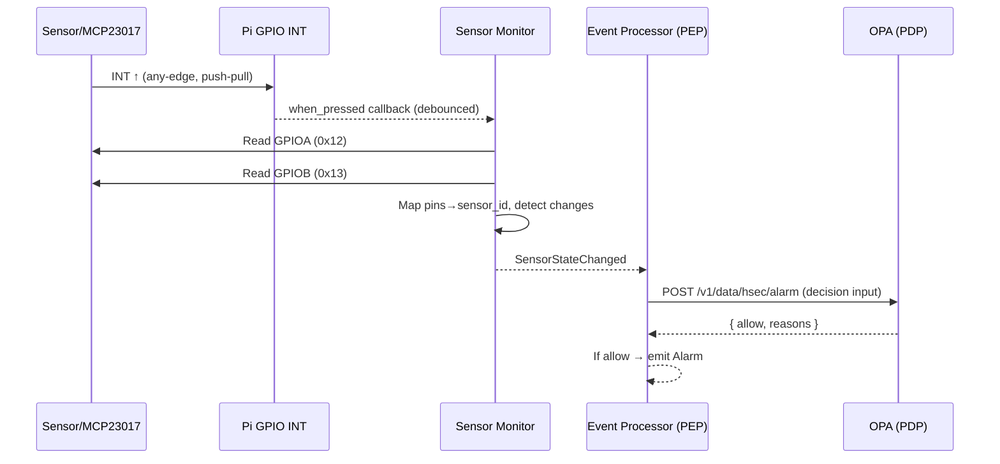

# Runtime Flows

## Interrupt and Event Flow
- Hardware interface details (register settings, INT polarity/debounce, clearing strategy) are normative in `docs/07-interface-contracts.md#hardware-interfaces`. This document focuses on sequencing and timing.

- Event sequence (Security BC subdomains: Sensing and Alarm Evaluation):
  1) Hardware change → INT rises → Sensor Monitor reads ports
  2) Sensing (Security BC subdomain) maps pins→`sensor_id`, compares with repository → emits `SensorStateChanged`
  3) Alarm Evaluation (Security BC subdomain) checks arming + time window → OPA policy → may emit `Alarm`

## Sequence (illustrative)

## Notes and Options

- Compare-to-previous allows both edges; rising-only can be configured via `DEFVALx` and `INTCONx` presets.
- Consider using INTCAPx to read latched state to avoid races if needed.
- Ensure external pull-ups vs `GPPU` are not double-enabled for the same line.

## Related

- Architecture: `docs/06-architecture-overview.md`
- Interfaces: `docs/07-interface-contracts.md`
- Contexts: `docs/04-context-map.md`
