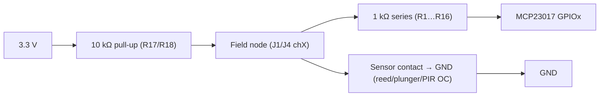
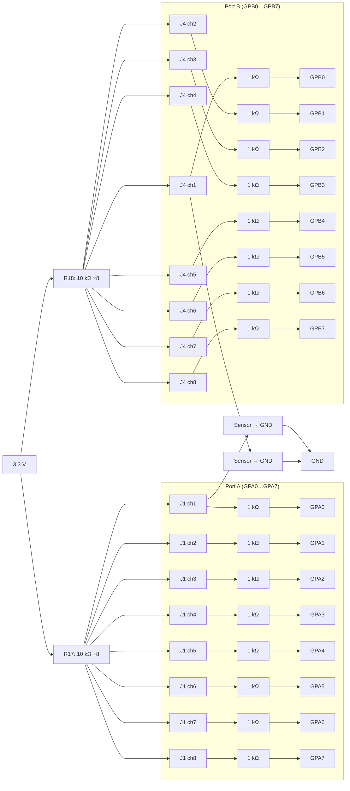
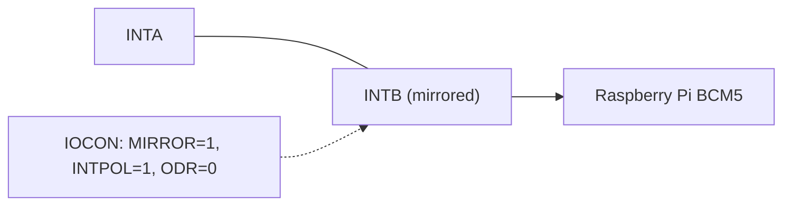

# MCP23017 Port Expander Input Circuit — Wiring and Calculations

Shared hardware circuit used to read door plunger switches, window reed contacts, and compatible PIR outputs with an MCP23017 I/O expander.

- Schematic: `img/port expander submodle schematic.png`
- Related device docs: `docs/devices/door-plunger-switch.md`, `docs/devices/reed-sensor.md`, `docs/devices/pir-sensor.md`
- Driver refs: `hardware/mcp23017.py`, `hardware/mygpio.py`

## Circuit overview

- Controller: MCP23017 at 3.3 V (`VDD = 3.3 V`, `VSS = GND`).
- Per-channel series resistor: 1 kΩ from each MCP GPIO to the field node (`R1…R16`) — ESD/misconfig current limiting.
- Pull-ups: Two 8× resistor packs, each 10 kΩ to 3.3 V (`R17`, `R18`). Each field node is pulled up to 3.3 V through 10 kΩ.
- Connectors:
  - Signal: `J1` (8 ch) and `J4` (8 ch) — field nodes (after the 1 kΩ series resistors).
  - Ground: `J2` and `J3`.
  - Host: `JP1` (3.3 V, GND, I2C SCL/SDA, INTA/INTB).
- INT wiring: Only `INTB` is wired to Raspberry Pi `BCM5`. Software enables mirroring so either port asserts INTB.

## Visual diagrams

### Single-channel equivalent

Notes:
- MCP GPIO input is high-impedance; 1 kΩ is for protection.
- When the sensor closes, current flows through the 10 kΩ pull-up to ground (≈0.33 mA).

### Bank overview (A and B)

### INT wiring

## Wiring patterns

- Reed/window contacts and door plungers (dry contacts):
  - One lead → a channel on `J1` or `J4`.
  - Other lead → GND on `J2` or `J3`.
  - Use twisted pair with one conductor as GND for long runs.
- PIR modules:
  - Open-collector/drain-to-GND → wire like a dry contact (no extra parts).
  - 3.3 V push-pull → connect to a channel; share ground.
  - 5 V push-pull → do not connect directly; level-shift or convert to open-drain. Power at 3.3 V only if the module supports it.

## Logic levels

- 10 kΩ pull-up biases node HIGH (~3.3 V) when sensor is open.
- Closing the sensor pulls node LOW (~0 V).
- MCP23017 input is high-Z; the 1 kΩ series does not affect logic levels in normal use; it limits fault/ESD current.
- CLI interpretation (`hardware/cli_status.py`):
  - `reed/contact`: 1 → "open", 0 → "closed".
  - `pir`: 1 → "motion", 0 → "no motion".

## Electrical calculations

Assume `VCC = 3.3 V`, `R_pullup = 10 kΩ`.

- Per closed channel current: `I = V/R = 3.3 / 10,000 ≈ 0.33 mA`.
- Per closed channel power (in pull-up): `P = V^2/R = 10.89e-1/10,000 ≈ 1.09 mW`.
- n simultaneous closed channels: `I_total ≈ 0.33 mA × n`, `P_total ≈ 1.09 mW × n`.
  - Example n=5 → `I_total ≈ 1.65 mA`, `P_total ≈ 5.45 mW`.
  - Worst case n=16 → `I_total ≈ 5.28 mA`, `P_total ≈ 17.4 mW`.

Notes:
- With sensor open, DC current ≈ 0 (ignore leakage).
- The 1 kΩ path conducts only during faults or if a pin is misconfigured as output.

## Optional RC filtering

Add a capacitor from node→GND for noise/bounce control:

- `τ = R_pullup × C`
- Examples: `C=0.1 µF → τ≈1 ms`; `C=0.47 µF → τ≈4.7 ms`.

## MCP23017 configuration (summary)

See `hardware/mcp23017.py`.

- `IOCON`: `MIRROR=1`, `ODR=0` (push-pull), `INTPOL=1` (active-high).
- Interrupt-on-change: `INTCONA/B=0x00` (compare-to-previous), `GPINTENA/B=0xFF`.
- Reads: `read_ports()` (GPIOA then GPIOB) to clear INT with MIRROR set.
- Pulls: Use external 10 kΩ; keep `GPPU=0x00`.

## Connector pin map (confirmed)

| Header | Pin | Port/Bit | Notes                     |
|:------ |:---:|:-------- |:--------------------------|
| J1     | 1   | GPA0     | confirmed                  |
| J1     | 2   | GPA1     | confirmed                  |
| J1     | 3   | GPA2     | confirmed                  |
| J1     | 4   | GPA3     | confirmed                  |
| J1     | 5   | GPA4     | confirmed                  |
| J1     | 6   | GPA5     | confirmed                  |
| J1     | 7   | GPA6     | confirmed                  |
| J1     | 8   | GPA7     | confirmed                  |
| J4     | 1   | GPB0     | confirmed                  |
| J4     | 2   | GPB1     | confirmed                  |
| J4     | 3   | GPB2     | confirmed                  |
| J4     | 4   | GPB3     | confirmed                  |
| J4     | 5   | GPB4     | confirmed                  |
| J4     | 6   | GPB5     | confirmed                  |
| J4     | 7   | GPB6     | confirmed                  |
| J4     | 8   | GPB7     | confirmed                  |

- INT line: `JP1` pin 7 (`INTB`) → Raspberry Pi `BCM5`.

## Safety and ratings

- ~1.09 mW per closed channel, ~17.4 mW when all 16 closed — within typical 1/8–1/4 W network ratings.
- Do not exceed 3.3 V on MCP inputs. Use level shifting for 5 V outputs.

## Traceability

- FR: `FR7 — Sensor Data Processing` (see `docs/10-requirements-traceability.md`).
- Stories: `ST-001` (PIR), `ST-002/003` (doors), `ST-004` (windows) in `docs/03-release-plan.md`.
